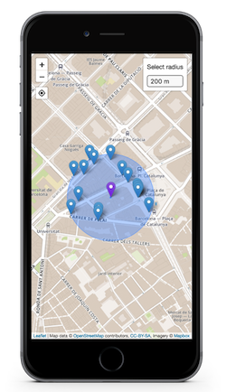

# Barcelona bicycle anchors points

Find public bicycle anchor points near you in Barcelona! [Check it out!](https://hiulit.github.io/barcelona-bicycle-anchor-points/dist/)

## Development

* [Download](https://nodejs.org/) and install Node.js and npm.
* Clone the project `git clone https://github.com/hiulit/barcelona-bicycle-anchor-points.git`.
* Install dependencies `npm install`.
* Run `grunt`.
* You can choose between:
    * Develop in a localhost server
    * Build for deployment
    * Build for deployment and start a localhost server

## API

* [apiHelper](/docs/apiHelper.md)
* [mapHelper](/docs/mapHelper.md)

## Changelog

### v1.0.0 (November 7th 2017)

* Released stable version.
* Created documentation for [apiHelper](/docs/apiHelper.md) and [mapHelper](/docs/mapHelper.md).

### v0.1.0 (October 23rd 2017)

* Released initial version.

# Contributing

First of all, I really appreciate that you're willing to ~~waste~~ spend some time contributing to **Barcelona Bicycle Anchor Points**! 🎉👍

You can help make **Barcelona Bicycle Anchor Points** better by [reporting issues](#issues) or [contributing code](#pull-requests).

## Issues

[Issues](https://github.com/hiulit/barcelona-bicycle-anchor-points/issues) can be used not only for bug reporting, but also for suggesting improvements, whether they are code related (cleaner code, modularity, etc.) or feature requests.

### Guidelines

* Search [previous issues](https://github.com/hiulit/barcelona-bicycle-anchor-points/issues?utf8=%E2%9C%93&q=is%3Aissue) before creating a new one, as yours may be a duplicate.
* Use a clear and descriptive title for the issue to identify the problem.
* Describe the exact steps which reproduce the problem in as many details as possible.

## Pull requests

[Pull requests](https://help.github.com/articles/creating-a-pull-request/) are most welcomed! 😃

* Fork **Barcelona Bicycle Anchor Points**: `git clone git@github.com:your-username/barcelona-bicycle-anchor-points.git`.
* Create a **new branch** and make the desired changes there.
* [Create a pull request](https://github.com/hiulit/barcelona-bicycle-anchor-points/pulls).

## Authors

Me 😛 [@hiulit](https://github.com/hiulit).

## License

MIT License

Copyright (c) 2017 Xavier Gómez Gosálbez

Permission is hereby granted, free of charge, to any person obtaining a copy
of this software and associated documentation files (the "Software"), to deal
in the Software without restriction, including without limitation the rights
to use, copy, modify, merge, publish, distribute, sublicense, and/or sell
copies of the Software, and to permit persons to whom the Software is
furnished to do so, subject to the following conditions:

The above copyright notice and this permission notice shall be included in all
copies or substantial portions of the Software.

THE SOFTWARE IS PROVIDED "AS IS", WITHOUT WARRANTY OF ANY KIND, EXPRESS OR
IMPLIED, INCLUDING BUT NOT LIMITED TO THE WARRANTIES OF MERCHANTABILITY,
FITNESS FOR A PARTICULAR PURPOSE AND NONINFRINGEMENT. IN NO EVENT SHALL THE
AUTHORS OR COPYRIGHT HOLDERS BE LIABLE FOR ANY CLAIM, DAMAGES OR OTHER
LIABILITY, WHETHER IN AN ACTION OF CONTRACT, TORT OR OTHERWISE, ARISING FROM,
OUT OF OR IN CONNECTION WITH THE SOFTWARE OR THE USE OR OTHER DEALINGS IN THE
SOFTWARE.
